# STEDI Human Balance Analytics - Glue Studio ETL Project

## 🧠 Project Overview
This project is part of the Udacity Data Engineering Nanodegree. It simulates a real-world scenario for building a data lakehouse architecture on AWS to process human balance data collected from mobile devices and IoT sensors. The goal is to curate clean, trusted, and machine-learning-ready data for analytics and predictive modeling.

Originally, the ETL pipeline was built entirely using **AWS Glue Studio Visual Jobs**, which auto-generated PySpark code. However, this project also demonstrates **partial infrastructure-as-code (IaC)** using **Terraform**.

---

## 📦 Infrastructure Notes (Terraform Setup)
The following core infrastructure was provisioned using Terraform:

- **S3 Bucket**: `stedi-datalake-terraform` with subfolders:
  - `customer_landing/`
  - `accelerometer_landing/`
  - `step_trainer_landing/`
- **AWS Glue Database**: `stedi_lake`
- **IAM Roles and Policies**: For Glue access

🔧 To provision the infrastructure:
```bash
terraform apply
```
Once your ETL pipeline is complete, clean up with:
```bash
terraform destroy
```

---

## 📊 Data Sources
The data is organized into three S3 folders:
- `customer_landing/`: User consent and profile info
- `accelerometer_landing/`: Accelerometer readings
- `step_trainer_landing/`: Step trainer timestamps and distances

### Sample Athena Row Count Checks:
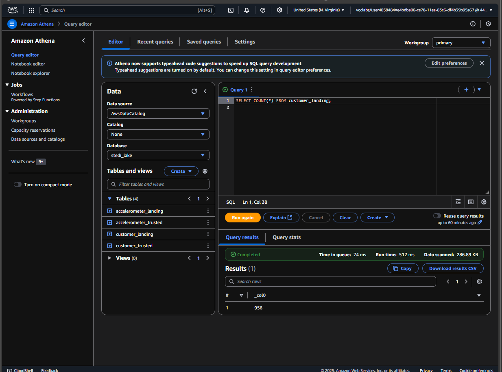  
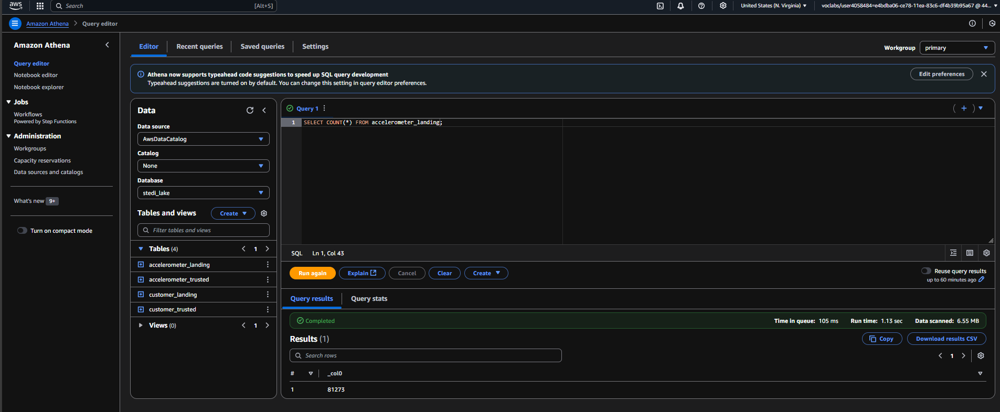  
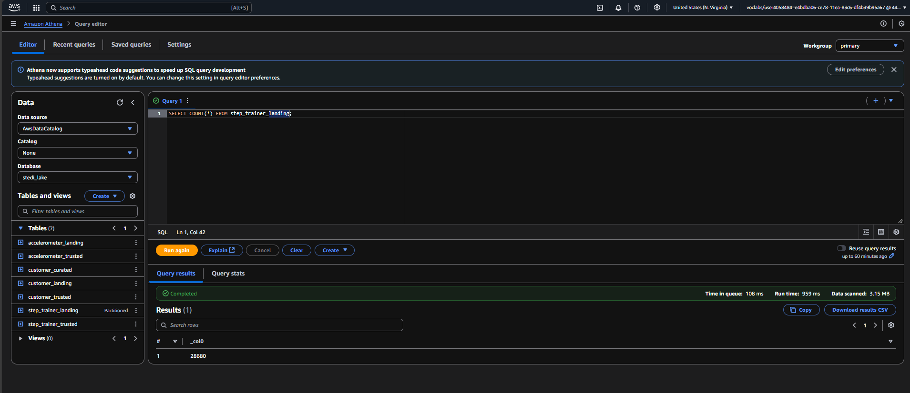

---

## 🔁 Data Pipeline Zones
This project follows a **Landing → Trusted → Curated** architecture:

### 1. **Landing Zone**
Raw data stored in JSON format is registered in the Glue Data Catalog using Athena DDL scripts:
- `customer_landing`
- `accelerometer_landing`
- `step_trainer_landing`

📄 Scripts:
- `customer_landing.sql`
- `accelerometer_landing.sql`
- `step_trainer_landing.sql`

📸 Supporting Screenshots:
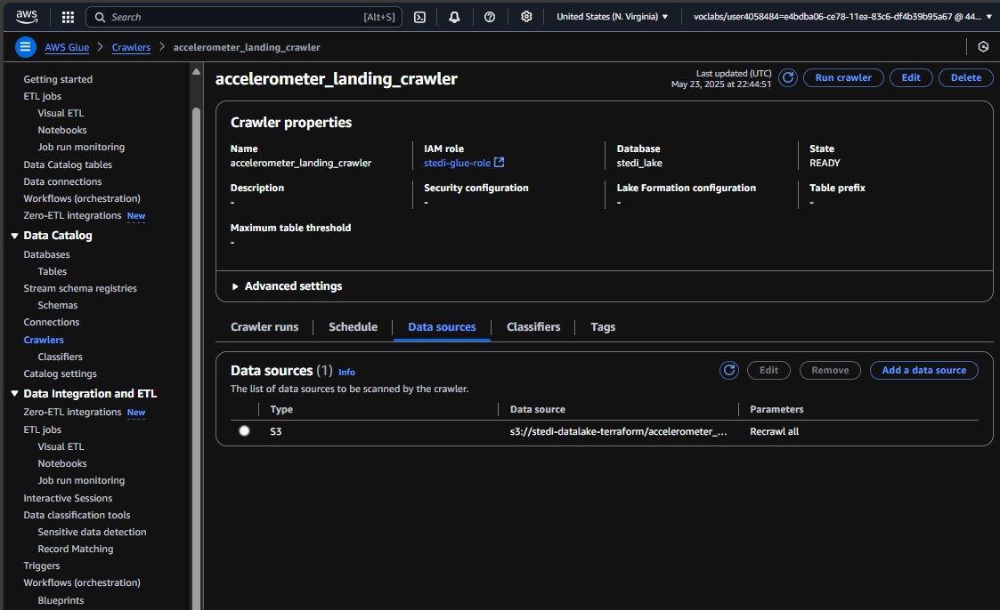  
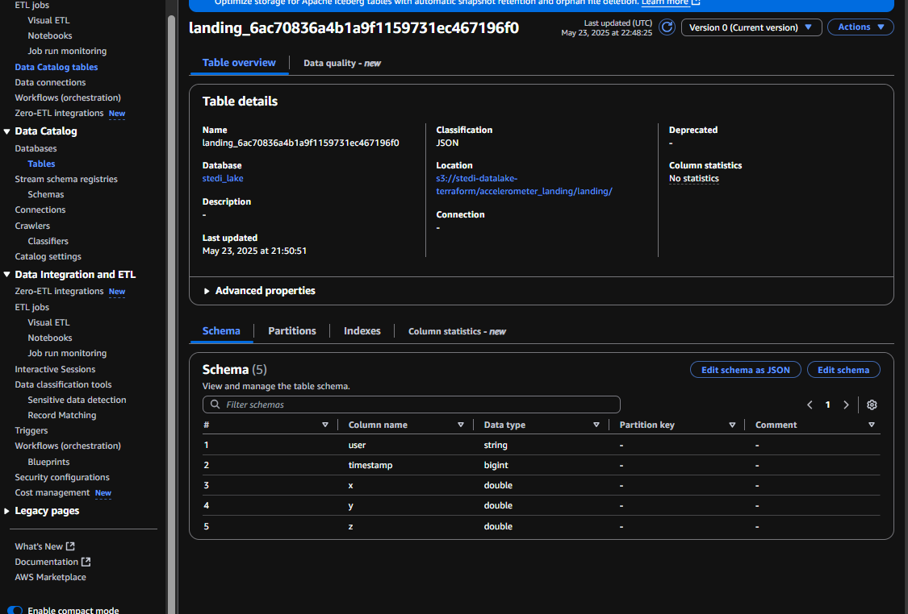

### 2. **Trusted Zone**
ETL jobs filter or join raw data to form clean, trusted tables:
- `customer_landing_to_trusted.py`: Filters users with consent only
- `accelerometer_landing_to_trusted.py`: Joins accelerometer data with trusted customers
- `step_trainer_trusted.py`: Moves raw step trainer data to trusted layer

📸 Sample Outputs:
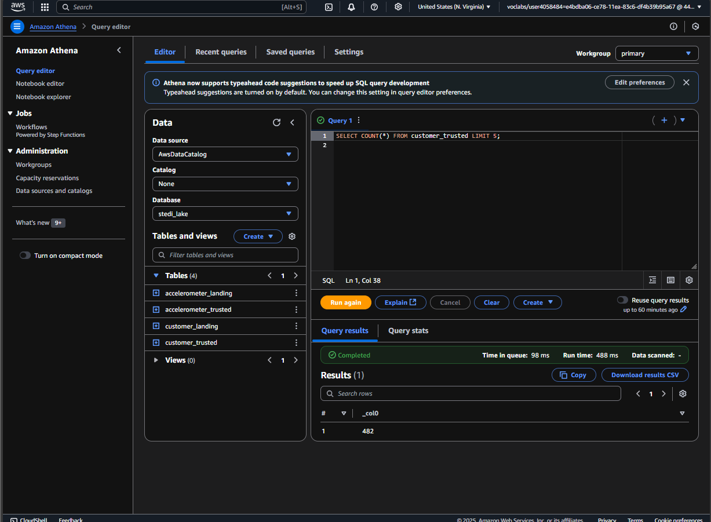  
  
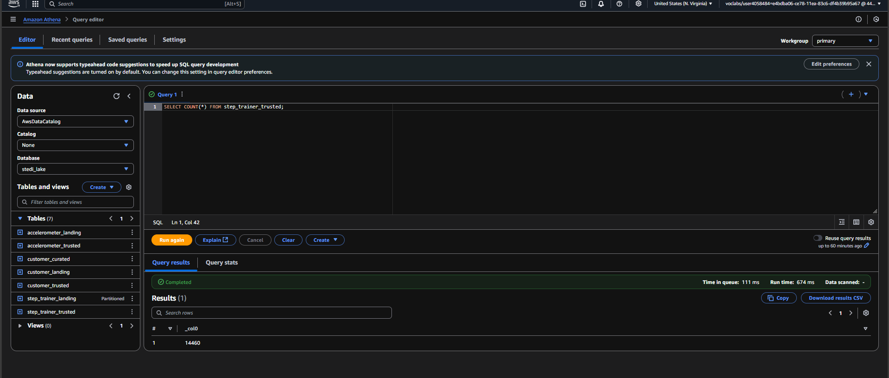

📸 EDR + Glue Visual Canvas:
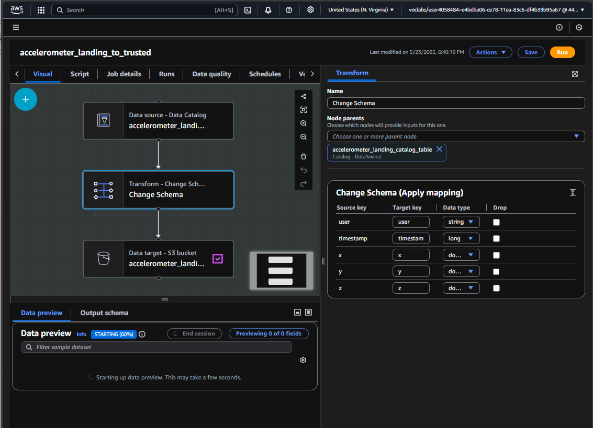  
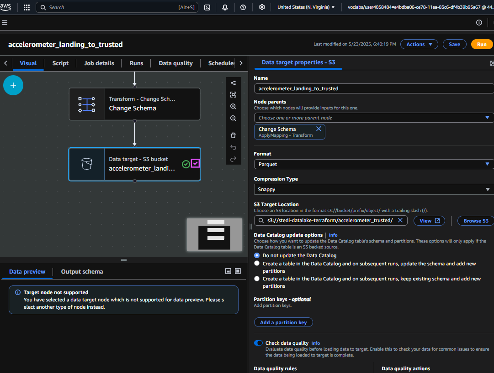  
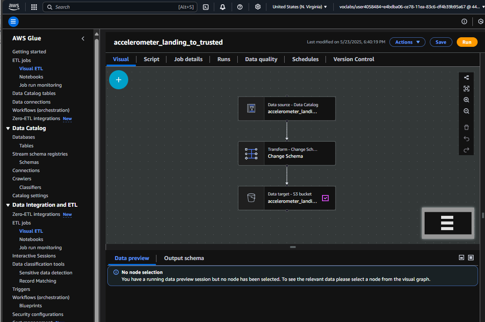  


---

### 3. **Curated Zone**
Final join and transformation steps to produce a machine-learning-ready dataset:
- `customer_trusted_to_curated.py`: Joins trusted customers with step trainer data by serialNumber
- `machine_learning_curated.py`: Joins trusted step trainer + accelerometer data using timestamp

📸 Final Output Preview:
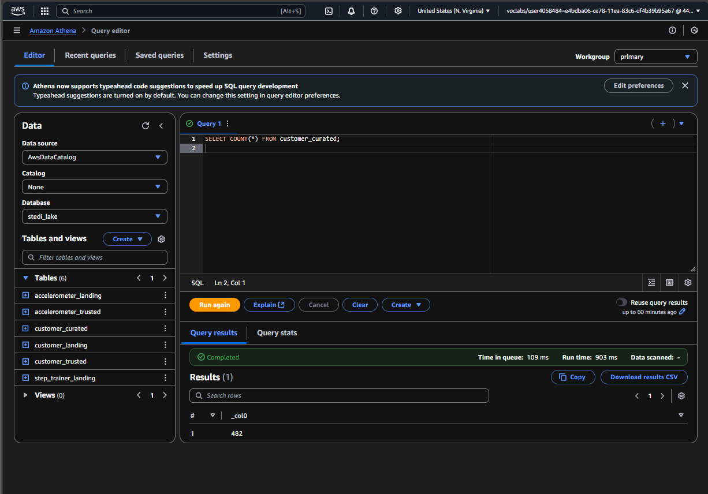  
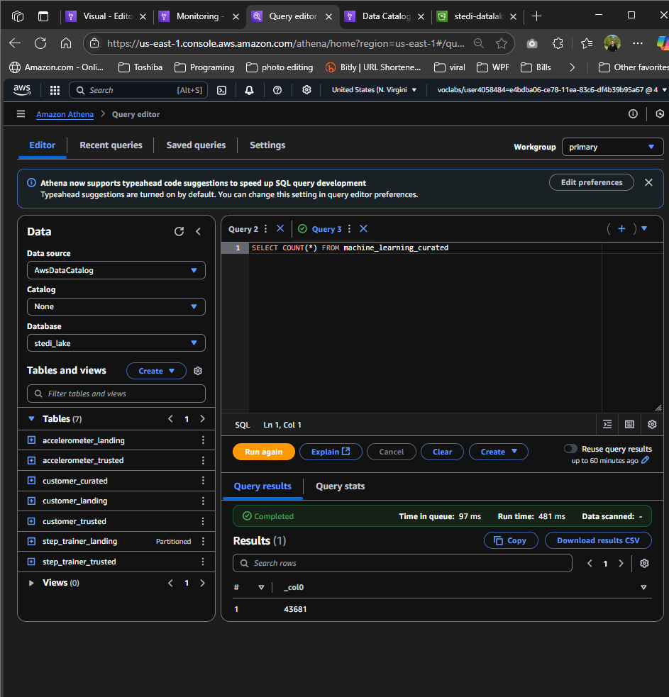

📸 EDR Proof for ML Output:
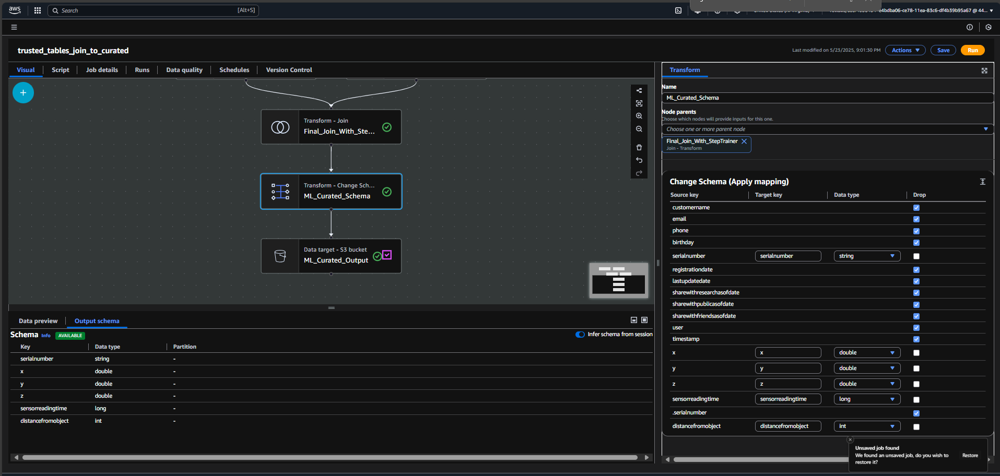  
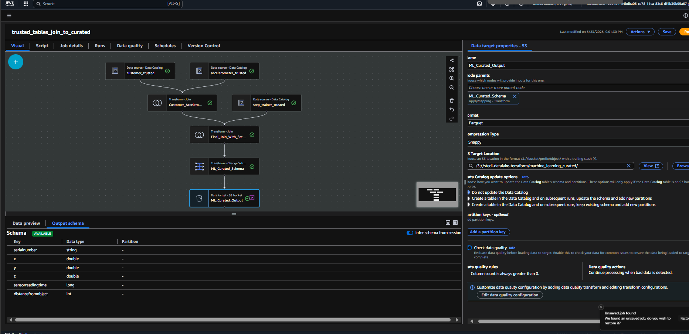  
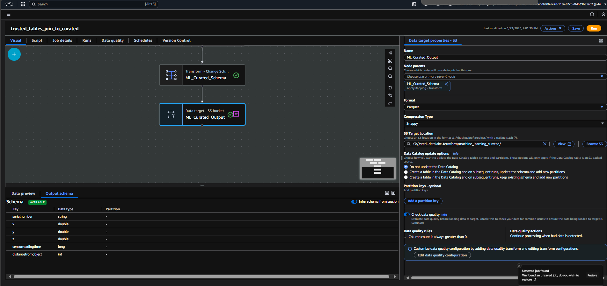  
  
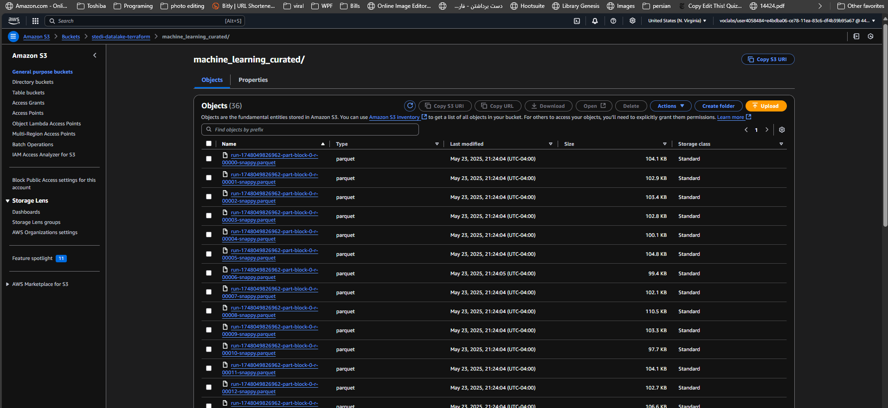

---

## 🧪 Tools & Tech Stack
- **Terraform**: Infrastructure provisioning
- **AWS Glue Studio**: Visual ETL design
- **AWS S3**: Landing and output storage
- **AWS Athena**: SQL validation & schema creation
- **AWS Glue Data Catalog**: Table registration
- **PySpark (auto-generated)**: Underlying job logic
- **SQL**: For schema creation and data validation

---

## 🧰 How to Use

### 1. Upload the data to your own S3 bucket:
```bash
aws s3 cp customer/ s3://your-bucket/customer_landing/ --recursive --profile your-profile
aws s3 cp accelerometer/ s3://your-bucket/accelerometer_landing/ --recursive --profile your-profile
aws s3 cp step_trainer/ s3://your-bucket/step_trainer_landing/ --recursive --profile your-profile
```

### 2. Register the Landing Zone tables using Athena (or Console):
Run each of the SQL scripts to register the landing zone tables:
- `customer_landing.sql`
- `accelerometer_landing.sql`
- `step_trainer_landing.sql`

### 3. Create Glue Visual Jobs:
Use Glue Studio to create jobs from visual mode and attach each `.py` script if needed for editing/debugging.

Recommended order to run jobs:
1. `customer_landing_to_trusted`
2. `accelerometer_landing_to_trusted`
3. `customer_trusted_to_curated`
4. `step_trainer_trusted`
5. `machine_learning_curated`

📸 Auto-generated Script Snapshots:
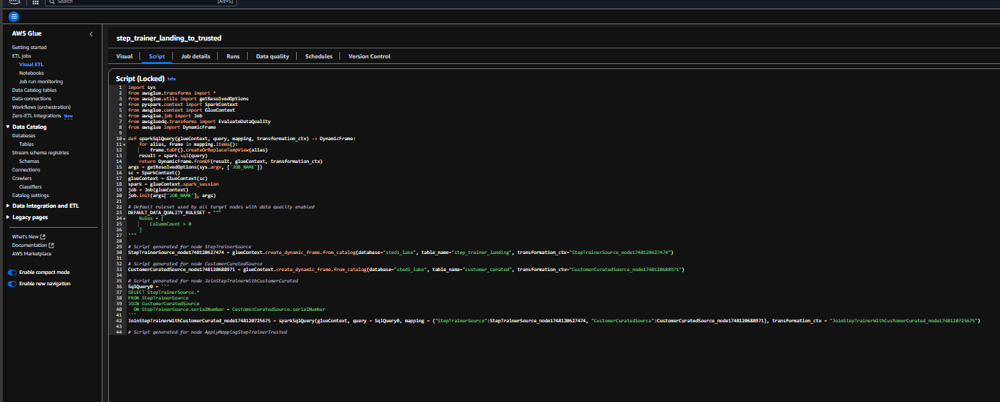  
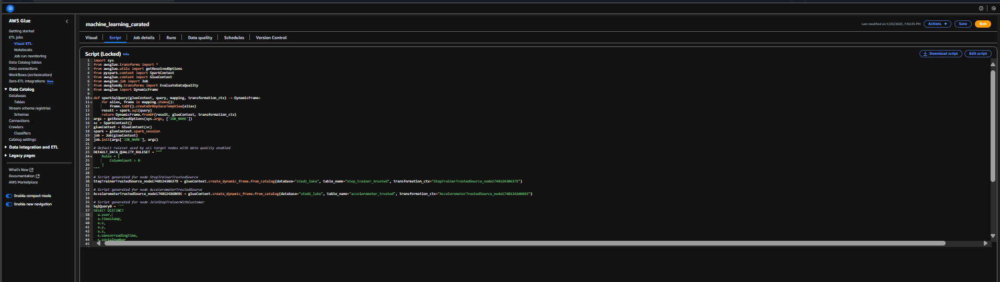

---

## ✅ Final Outcome
The `machine_learning_curated` table contains:
- ~43,681 validated rows
- Accurate sensor join via timestamp alignment
- ML-ready format

You can now query this table in Athena or export to SageMaker for modeling.

---

## 🙌 Acknowledgments
Thanks to Udacity for the challenging scenario and AWS Glue Studio for making visual ETL fast and accessible.
