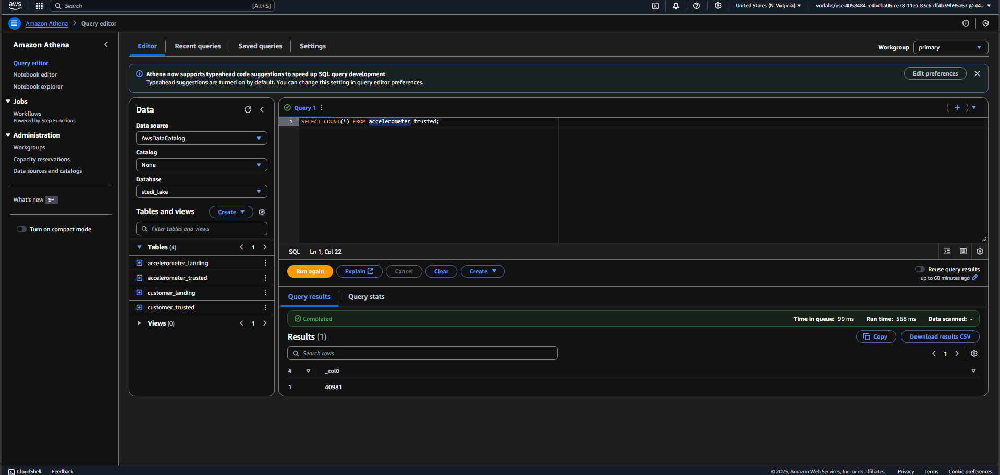
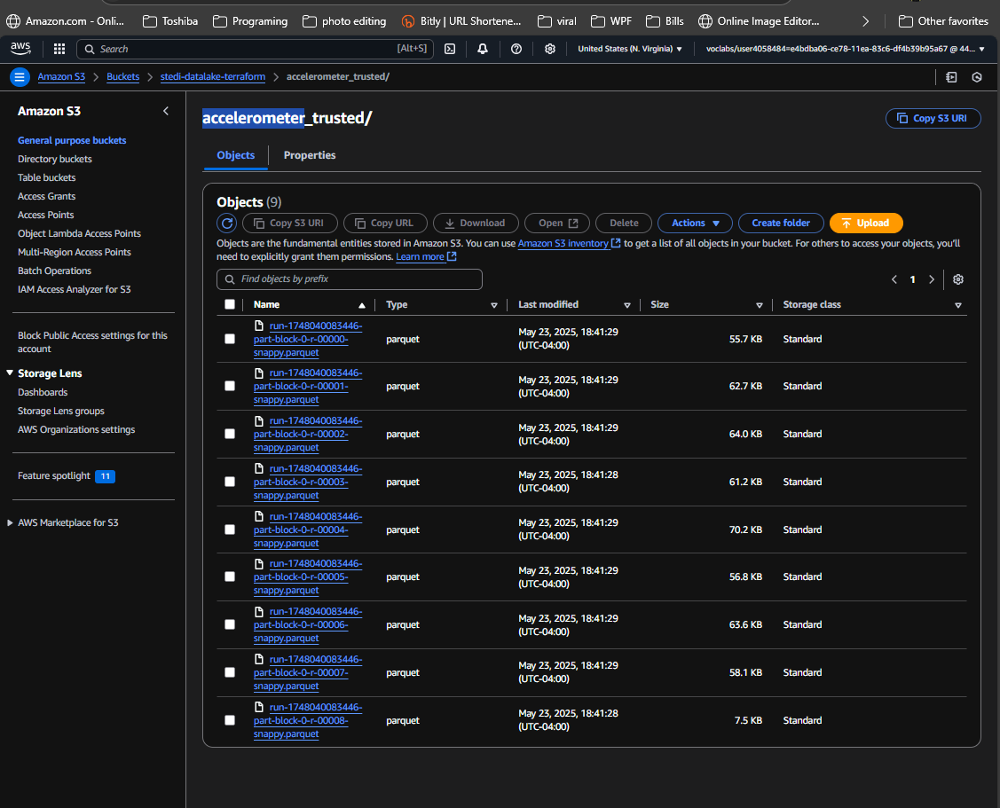
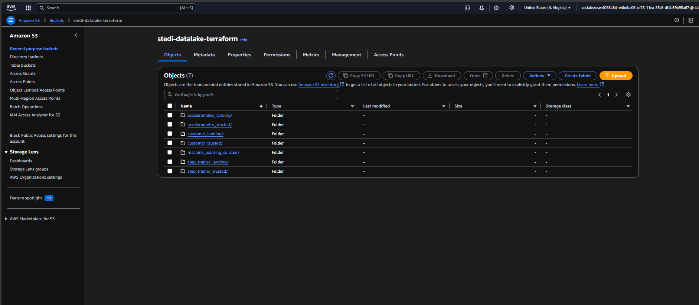

# STEDI Human Balance Analytics - Glue Studio ETL Project

## 🧠 Project Overview

This project is part of the Udacity Data Engineering Nanodegree. It simulates a real-world scenario for building a data lakehouse architecture on AWS to process human balance data collected from mobile devices and IoT sensors. The goal is to curate clean, trusted, and machine-learning-ready data for analytics and predictive modeling.

Originally, the ETL pipeline was built entirely using **AWS Glue Studio Visual Jobs**, which auto-generated PySpark code. However, this project also demonstrates **partial infrastructure-as-code (IaC)** using **Terraform** for setting up core infrastructure such as the S3 bucket and Glue database.

---

## ⚠️ Prerequisites & Budget Considerations

Before proceeding, ensure the following:

- ✅ You have configured your AWS **access keys** inside `terraform.tfvars`:

```bash
aws_access_key = "YOUR_ACCESS_KEY"
aws_secret_key = "YOUR_SECRET_KEY"
```

- 🧾 AWS services used in this project may incur charges, especially:
  - Athena queries (~$5 per TB scanned)
  - Glue jobs
  - S3 storage

💡 **Tips to minimize budget**:
- Delete all provisioned resources with `terraform destroy` after testing
- Keep datasets small
- Use Athena sparingly and filter early

---

## 📦 Infrastructure Notes (Terraform Setup)

The following core infrastructure was provisioned using Terraform:

- **S3 Bucket**: `stedi-datalake-terraform` with subfolders:
  - `customer_landing/`
  - `accelerometer_landing/`
  - `step_trainer_landing/`
- **AWS Glue Database**: `stedi_lake`
- **IAM Roles and Policies**: For Glue jobs

📦 To deploy infrastructure:

```bash
terraform init
terraform apply
```

To destroy and clean up:

```bash
terraform destroy
```

---

## 📊 Data Sources

The data is organized into three S3 folders:

- `customer_landing/`: User consent and profile info
- `accelerometer_landing/`: Accelerometer readings
- `step_trainer_landing/`: Step trainer timestamps and distances

📸 Sample Row Count Checks:

  
  


---

## 🔁 Data Pipeline Architecture

The pipeline follows a standard **Landing → Trusted → Curated** pattern:

---

### 1️⃣ Landing Zone

Raw data is registered in the Glue Data Catalog via Athena SQL scripts:

- `customer_landing.sql`
- `accelerometer_landing.sql`
- `step_trainer_landing.sql`

📸 Example crawler and table:

  


---

### 2️⃣ Trusted Zone

Visual ETL jobs in Glue Studio filter or prepare the data:

- `customer_landing_to_trusted.py`: Filters consented customers
- `accelerometer_landing_to_trusted.py`: Joins with customers
- `step_trainer_trusted.py`: Promotes step trainer data

📸 Trusted zone outputs:

  
  


📸 Glue Visual ETL Canvas:

  
  
  


---

### 3️⃣ Curated Zone

Final jobs to prepare ML-ready data:

- `customer_trusted_to_curated.py`: Joins customer + step trainer
- `machine_learning_curated.py`: Joins result with accelerometer

📸 Curated outputs:

  


📸 Join logic & output folder:

  
  
  
  


---

## 🧰 How to Use

### Step 1: Upload the data

```bash
aws s3 cp customer/ s3://your-bucket/customer_landing/ --recursive
aws s3 cp accelerometer/ s3://your-bucket/accelerometer_landing/ --recursive
aws s3 cp step_trainer/ s3://your-bucket/step_trainer_landing/ --recursive
```

### Step 2: Register tables with Athena

Run SQL scripts:
```sql
-- Example: customer_landing.sql
CREATE EXTERNAL TABLE stedi_lake.customer_landing (
  ...
)
LOCATION 's3://your-bucket/customer_landing/';
```

### Step 3: Create Visual Glue Jobs

Create jobs in Glue Studio and map the auto-generated scripts:

1. `customer_landing_to_trusted`
2. `accelerometer_landing_to_trusted`
3. `customer_trusted_to_curated`
4. `step_trainer_trusted`
5. `machine_learning_curated`

📸 Example Glue job scripts:

  


---

## ✅ Final Outcome

The final curated table is:

- ML-ready
- Includes accurate timestamp joins
- ~43,681 clean rows

Use Athena to query or export to SageMaker.

---

## 🙌 Acknowledgments

Thanks to Udacity for the use case and AWS Glue Studio for its powerful visual ETL interface.

